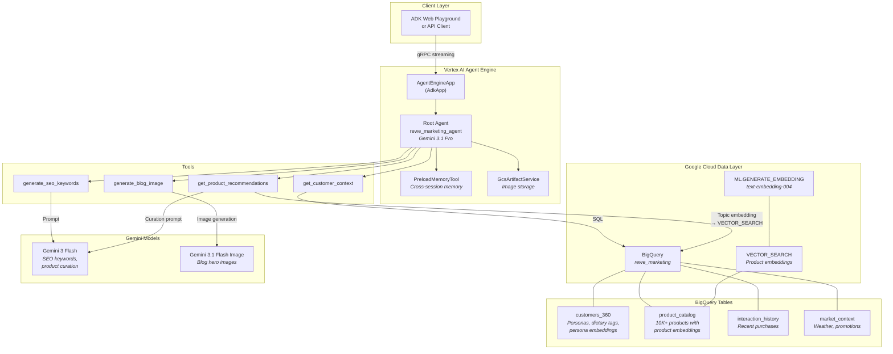
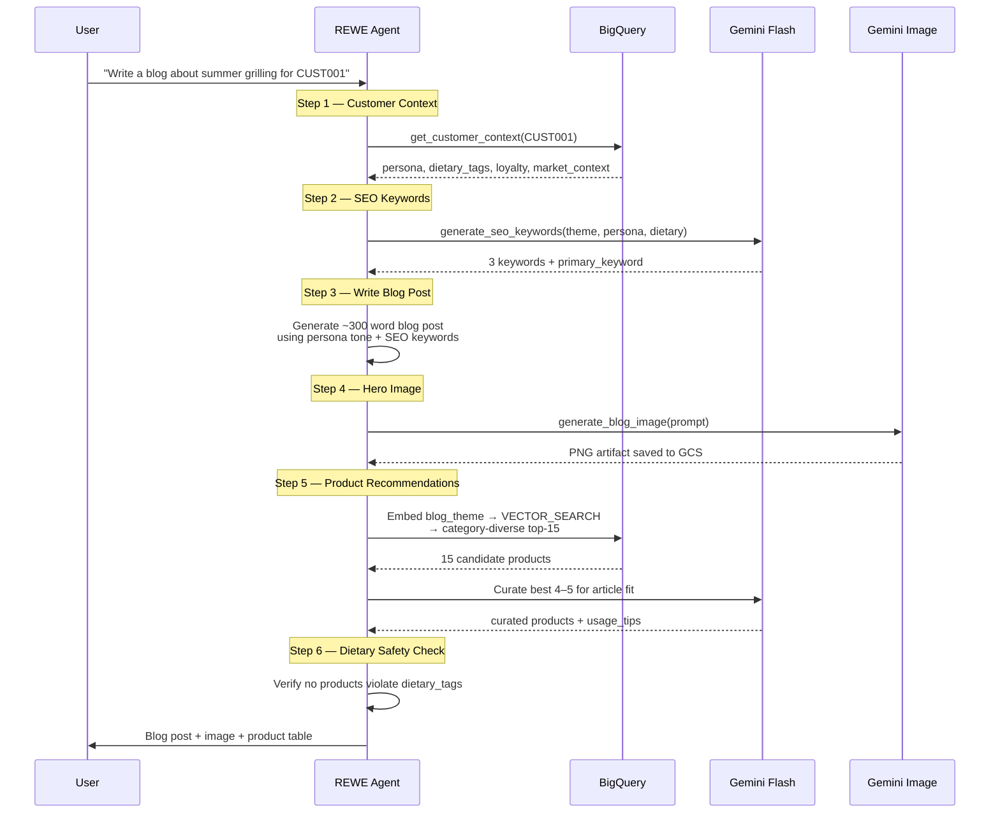

# REWE Marketing Agent

An AI-powered marketing content agent that generates **personalized, SEO-optimized blog posts** with product recommendations for [REWE](https://www.rewe.de/), a leading German grocery retailer. Built with the [Google Agent Development Kit (ADK)](https://adk.dev/) and deployed on [Vertex AI Agent Engine](https://cloud.google.com/vertex-ai/generative-ai/docs/agent-engine/overview).

## What It Does

Given a customer ID and a blog topic, the agent autonomously:

1. **Retrieves customer context** — persona, dietary restrictions, loyalty tier, purchase history, and real-time market context (weather, promotions)
2. **Generates SEO keywords** — 3 targeted long-tail keywords tailored to the customer persona and blog theme
3. **Writes a personalized blog post** — ~300 words matching the customer's tone (e.g., energetic for athletes, mindful for vegans)
4. **Creates a hero image** — AI-generated food photography via Gemini's image generation
5. **Recommends products** — 4–5 curated products from a 10K+ product catalog using semantic vector search with category diversity
6. **Validates dietary safety** — ensures no recommended product violates the customer's dietary restrictions

Everything is generated in the user's language (English or German) with zero language mixing.

## Architecture



## Agent Workflow



## Product Recommendation Pipeline

The recommendation system uses a 3-step pipeline that prioritizes **article relevance** over generic persona matching:

| Step | What It Does | How |
|------|-------------|-----|
| **1. Customer Profile** | Fetch dietary tags, price sensitivity, persona | SQL query on `customers_360` |
| **2. Topic-Seeded Vector Search** | Find products relevant to the *blog theme* | `ML.GENERATE_EMBEDDING` on the theme text → `VECTOR_SEARCH` against `product_catalog` embeddings, with `ROW_NUMBER() PARTITION BY category_path` to enforce max 3 per category |
| **3. LLM Curation** | Select the best 4–5 from ~15 diverse candidates | Gemini Flash ranks by article fit, dietary safety, price sensitivity, and category diversity; generates actionable `usage_tip` per product |

**Fallback:** If topic embedding fails, the pipeline falls back to persona-embedding search using the customer's pre-computed `persona_embedding`.

## Project Structure

```
rewe-agent/
├── app/
│   ├── agent.py                 # Agent definition, instruction prompt, tool bindings
│   ├── tools.py                 # 4 tools: customer context, SEO, products, image gen
│   ├── agent_runtime_app.py     # AgentEngineApp (AdkApp subclass) for deployment
│   └── app_utils/
│       ├── telemetry.py         # OpenTelemetry → Cloud Trace + BigQuery
│       └── typing.py            # Feedback schema (Pydantic)
├── tests/                       # Unit, integration, and load tests
├── test_agent_runtime.py        # REST/SSE integration test
├── test_agent_runtime_sdk.py    # Official SDK integration test
├── create_genai_agent_evaluation.ipynb  # Agent evaluation notebook
└── pyproject.toml               # Dependencies (uv)
```

## Tech Stack

| Layer | Technology |
|-------|-----------|
| **Agent Framework** | [Google ADK](https://adk.dev/) (Agent Development Kit) |
| **LLM (Orchestration)** | Gemini 3.1 Pro Preview |
| **LLM (Tools)** | Gemini 3 Flash Preview (SEO, curation) |
| **Image Generation** | Gemini 3.1 Flash Image Preview |
| **Deployment** | Vertex AI Agent Engine (Reasoning Engine) |
| **Data** | BigQuery (customer 360, product catalog, interactions, market context) |
| **Search** | BigQuery VECTOR_SEARCH with `text-embedding-004` |
| **Memory** | ADK PreloadMemoryTool (cross-session learning) |
| **Artifacts** | GCS via ADK ArtifactService (generated images) |
| **Observability** | Cloud Trace, Cloud Logging, BigQuery telemetry |
| **Evaluation** | Vertex AI Gen AI Evaluation SDK |

## Quick Start

### Local Development

```bash
# Install dependencies
agents-cli install

# Launch interactive playground (auto-reloads on save)
agents-cli playground
```

### Deploy to Agent Engine

```bash
gcloud config set project sa-learning-1
agents-cli deploy
```

### Test the Deployed Agent

```bash
# Via official SDK (recommended)
python test_agent_runtime_sdk.py

# Via REST/SSE
python test_agent_runtime.py
```

### Run Evaluation

Open `create_genai_agent_evaluation.ipynb` and run all cells. The notebook uses a custom inference implementation that works around a known SDK issue with `stream_query()` on deployed ADK agents.

## Environment Variables

| Variable | Description | Default |
|----------|-------------|---------|
| `GOOGLE_CLOUD_PROJECT` | GCP project ID | Auto-detected |
| `GOOGLE_CLOUD_LOCATION` | Agent Engine region | `global` |
| `GOOGLE_GENAI_USE_VERTEXAI` | Use Vertex AI backend | `True` |
| `LOGS_BUCKET_NAME` | GCS bucket for image artifacts | (in-memory if unset) |

## Known Issues

- **Eval SDK `stream_query` bug:** The evaluation SDK's `run_inference()` calls `stream_query()` which returns empty responses on deployed ADK agents over gRPC. The evaluation notebook includes a workaround using `streaming_agent_run_with_events` instead. See `create_genai_agent_evaluation.ipynb` for details.
